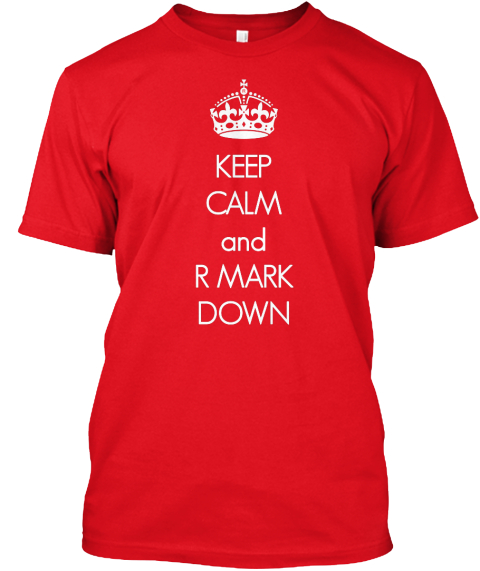
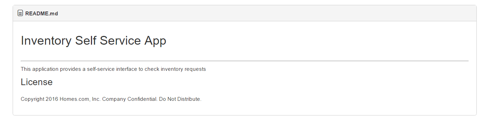
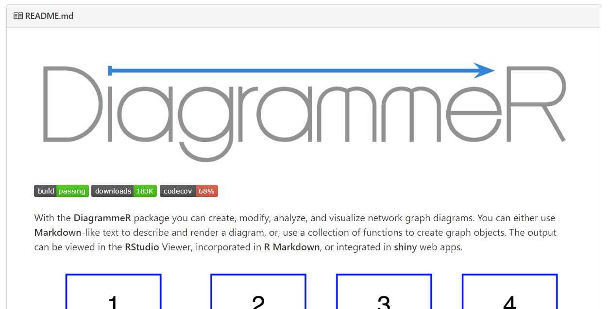
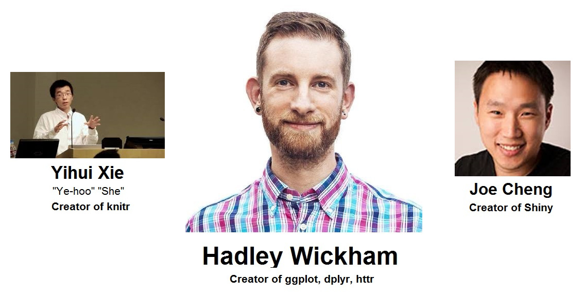
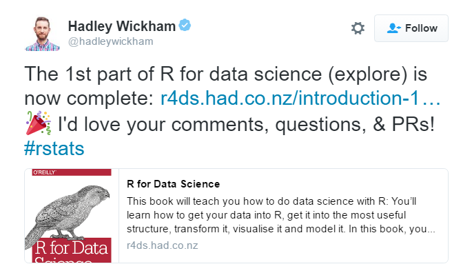
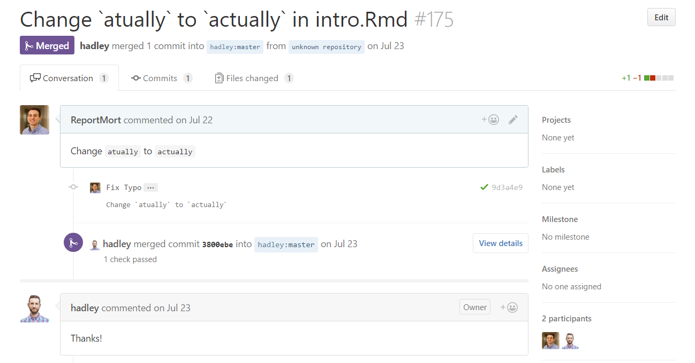

Land a Job Writing R Code
========================================
author: Steve Mortimer
date: October 18th, 2016
css: css-presentations.css

upfront
====================================================
title: false
<h3>
  

  Attribution   This presentation is an adaption of another presentation by Chris Mar (@cmar) entitled:   <a href="https://www.youtube.com/watch?v=nZNfSQKC-Yk">The Art of Ruby Technical Interviews</a>
  

</h3>

You've been Checking out R
====================================================

 

***

 
 

Pick a project, Passion is interesting
====================================
left: 50%

 
 
 
 

***

 
 
 

Build, Deploy, Share
====================================
left: 60%

 

1. Build It! 
2. Tell Others about it! 
3. Check it into GitHub
4. Put it on your resume, but one thing...

***

 

Make a Good Looking README
====================================

 
A bad README (not exciting at all!)

An awesome README!
====================================

Know the Community
====================================

 
R is a <u>community</u>, it is open-source

* Who is the community?
* Where is it going?
* Any new updates?
* Ask Questions!

<blockquote>"Hey, R Notebooks just got released!" "Are you guys thinking about switching?" </blockquote>

Know the Thought Leaders!
====================================

 
  
 

  <ul>
    <li>Where are they speaking?</li>
    <li>What projects are they working on?</li>
  <ul>
 

Big Conferences
====================================

 

Know the tools, packages, etc.
====================================
* Must Know
  * dplyr, ggplot2
* Should Know
  * knitr, rmarkdown, pander, shiny, httr
* Nice to Know
  * data.table, doSNOW, testthat
  * cart, e1071, randomForest, glmnet, caret 

<blockquote>
Have a preference! Say:  &nbsp;&nbsp;&nbsp;"I'm open to tibble, but right now I like data.table."
</blockquote>

Commit to Open Source
====================================================

 

Even tiny contributions are valid!
====================================================

Doing the Job Search
====================================================
 

1. Research technologies and projects included on job postings that ask for R skills. 
  * Stay away from posts with SPSS, SAS or blend of other dissimilar technologies 

2. Stalk employees at the company
  * Check them out on Twitter, Github, etc.

At the interview
====================================================
 

1. Don't say you are a novice or an expert! Say you are proficient. 
2. Your attitude should be curious, solution oriented. Solving problems is what matters at this stage, not fluency in R
3. Work your angle - (ie Know Computer Science, want to do more analysis, Know Analysis, want to do more computer science)

Answering Technical Questions
====================================================
 
* Don't say I could Google it! 
* Don't be afraid to ask for help
* The interviewers want to hire you

end
====================================================
title: false
<h3>
  

  Best of Luck!
  

</h3>

